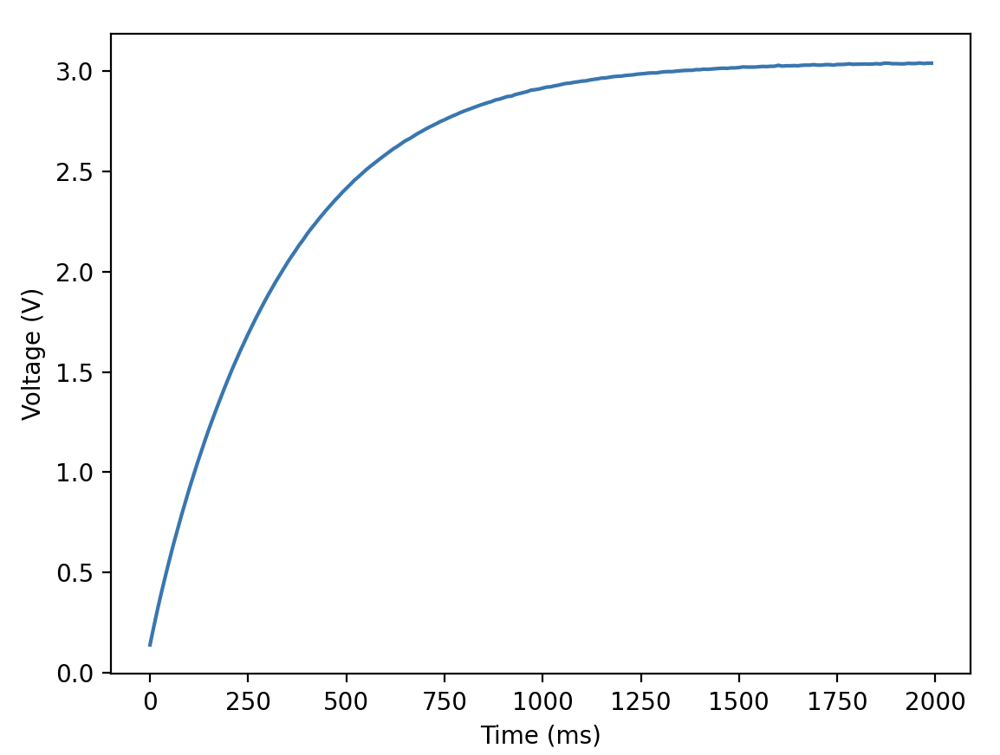

## ME 405 Lab 0

### Authors
By: Jack Krammer, Ahren Dosanjh, and Lorenzo Pedroza

California Polytechnic State University

January 29, 2024

### Description
In an introduction to MicroPython and the Thonny Python IDE, we measured the step response by using a builtin timer and ADC on the STM32 Nucleo L476RG board.

### Results

Figure 1. The graphical representation of the step response.
